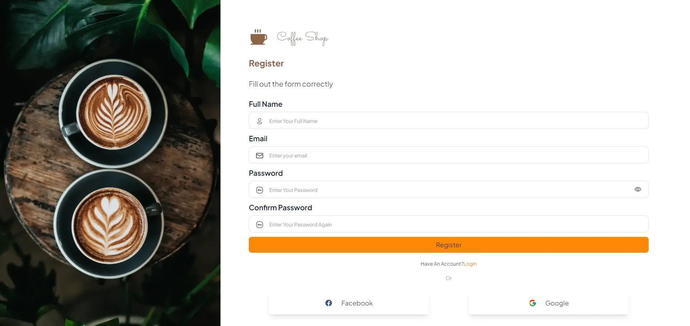
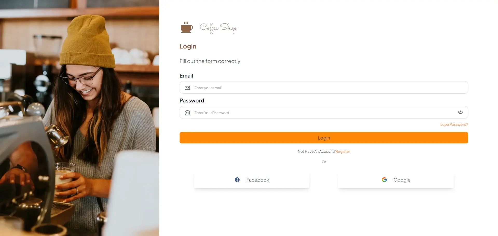
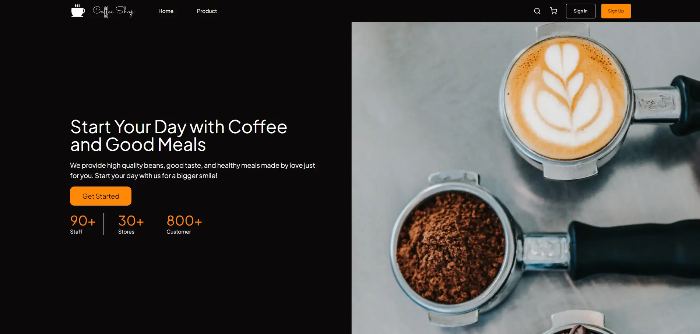
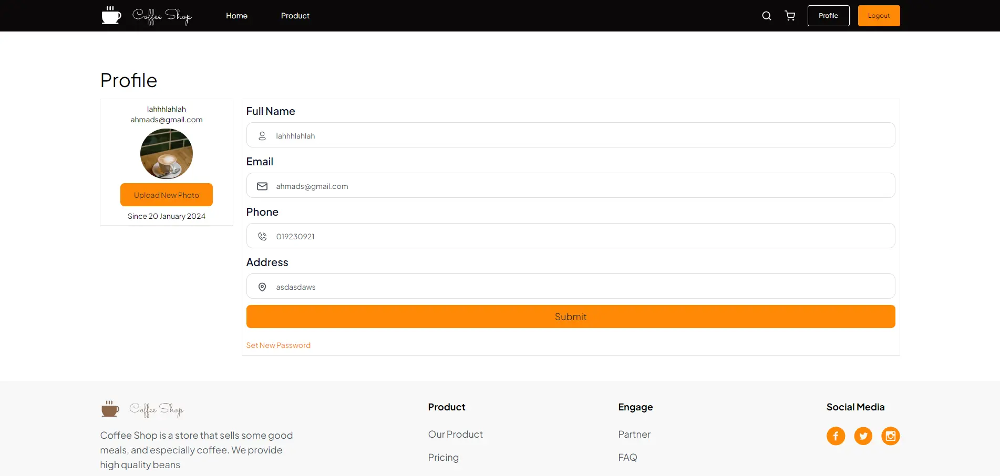
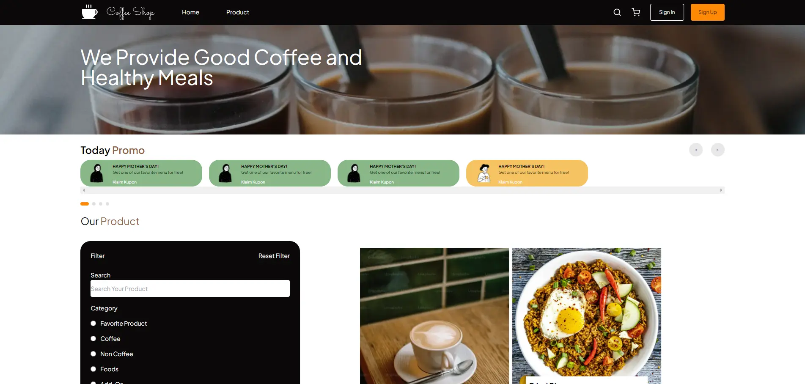
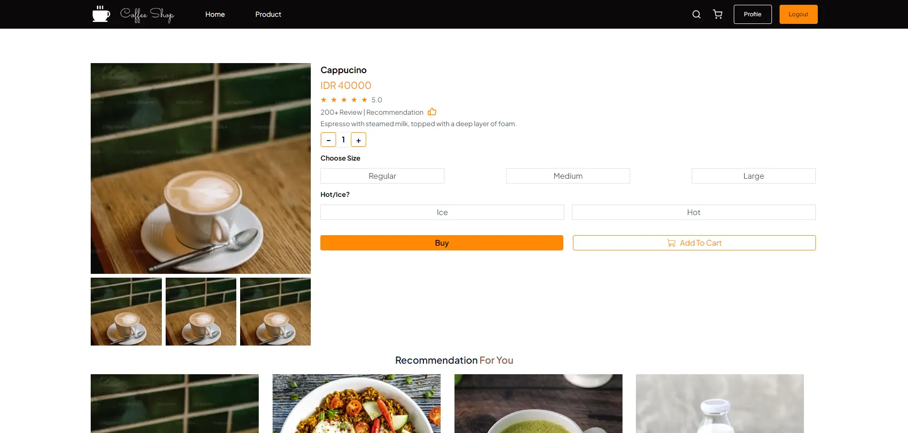
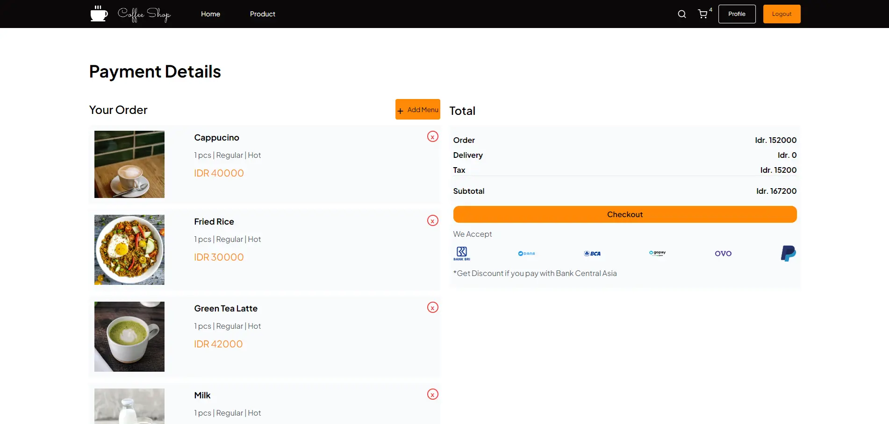
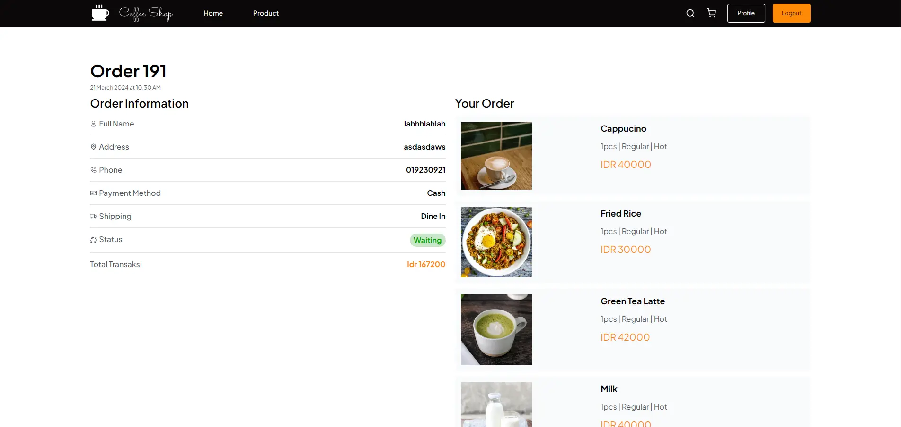
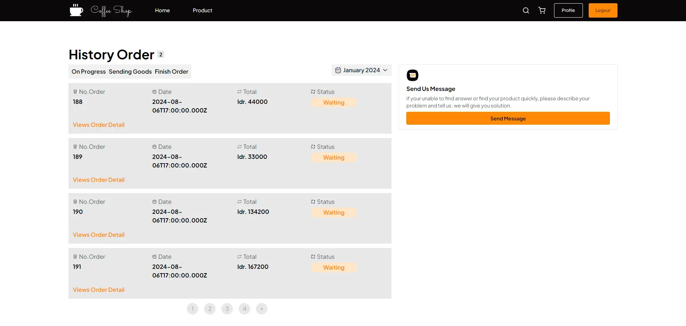

# Coffee Shop Web

Coffee Shop Web adalah website sederhana untuk mengelola coffee shop. Aplikasi ini mempermudah pengguna jika ingin membuat sebuah usaha tempat kopi.

## Daftar Isi

1. [Tentang Proyek](#tentang-proyek)
   - [Fitur](#fitur)
   - [Teknologi](#teknologi)
   - [Screenshot](#screenshot)
2. [Mulai](#mulai)
3. [Kontak](#kontak)

## Tentang Proyek

Website Coffee Shop ini dibangun dengan tujuan untuk memudahkan pengguna dalam mengelola usaha coffee shop. Website ini menggunakan html, css, tailwind css, dan react js sebagai pengembang dalam pembuatan.

### Fitur

- Halaman Register
- Halaman Login
- Halaman Home
- Halaman Profile
- Halaman Product
- Halaman Detail Product
- Halaman Checkout
- Halaman Detail Order
- Halaman History Order

### Teknologi

- HTML
- CSS
- Tailwind CSS
- React JS

### Screenshot

#### Register Page



#### Login Page



#### Home Page



#### Profile Page



#### Product Page



#### Detail Product Page



#### Checkout Page



#### Detail Order Page



#### History Order Page



## Mulai

1. Clone repositori ini

```bash
$ git clone https://github.com/khalifgfrz/coffee-shop-fe-react.git
```

2. Install dependensi

```bash
$ npm install
```

3. Jalankan Aplikasi

```bash
$ npm start
```

## Kontak

Khalif Gaffarezka Auliasoma - kgaffarezka@gmail.com
Link Proyek: https://github.com/khalifgfrz/coffee-shop-fe-react.git
